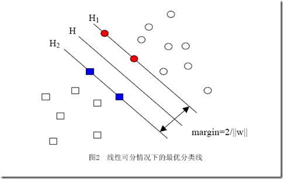
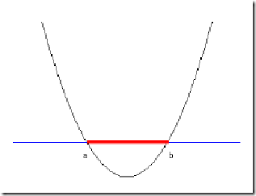

# 实验报告

## 1. 实验目的

通过对数据仓库与数据挖掘课程的学习，了解一些数据挖掘的基本算法，在整体上认识 和加深对数据挖掘的理解，并掌握以下技术:  

1. 掌握数据预处理的方法，对训练集进行采集;
2. 掌握文本建模的方法，对语料库档进行建模;
3. 掌握分类算法的原理，基于有监督机器学习方法训练文本;
4. 利用学习的文本分类器，对未知文本进行判别;
5. 掌握评价分类器性能的估方法。

## 2. 实验环境

### 2.1 工具

1. 爬虫程序参考[[github]新浪新闻文本分类](https://github.com/qyfang/TextClassification)项目`spider.py`完成，使用了新浪滚动新闻[API](http://api.roll.news.sina.com.cn/)和清华开放新闻数据[THUCNEWS](http://thuctc.thunlp.org/message)，爬取100w 篇文本；
2. 分词工具：[pynlpir](https://pypi.org/project/PyNLPIR/)，去除了所有的长度不足 2 的词，以及除去名词外的词汇，用时约 4 个小时；
3. 使用`python`机器学习包`sklearn`进行数据预处理以及对比
4. 使用`python`数据处理工具`numpy` `pandas`进行数据存储、矩阵运算及表示
5. 使用`pickles`进行数据保存

### 2.2 环境

所有代码在 `Anaconda Python 3.6.3`环境运行

## 3. 文本分类项目设计原理

### 3.1 数据库介绍

1. 将爬虫文本按照`标签`目录/`标题.txt`文件组织，共有 `128W` 余篇文本，分为'财经', '股票', '教育', '科技', '时政', '体育', '游戏', '娱乐', '汽车', '社会', '军事'。
2. 将分词数据按照 `序号`、`数据`、`标签`组织，合为统一的 `works.csv` 表格。
3. 将数据词向量化之后，为约 `128W * 47W` 的稀疏矩阵，将得到的 `(矩阵, 标签, 词典)` 三元组存储到 `BOW.pkl`。

### 3.2 数据预处理

采用卡方检验降维，以`体育`类的关键词`篮球`为例，

  || 体育类 | 其他类 | 总数
 - | - | - | -
 `篮球` | A | B | A + B
 `非篮球`| C | D | C + D
 总数 | A + C | B + D | N

公式如下：  
$$
K ^ 2 = \frac{N(AD - BC)^2}{(A + B)(A + C)(B + C)(B + D)}
$$

对每一个词在每一类中的卡方进行类似计算，可以得到每一类的卡方值从大到小的排列，从中选出前 10000 个作为机器学习的样本维度。  

### 3.3 机器学习方法

#### 3.3.1 朴素贝叶斯

1. 条件概率  

$$
P(T|C) = \frac{P(TC)}{P(C)}
$$

其中C为classfication，T为Term，P(TC)指的是在某一类别中的特定的词的概率，通过频率推断，P(C)为该类别出现的几率，先验概率。

2. 贝叶斯公式  

将文档中各个词汇视为独立，则文档在某一类别的概率可以视为各个词汇的概率的乘积：  
$$
P(C|Document) = \prod^N{P(C|T)}
$$

，其中 `N = 10000`，表示维度。

$$
P(C|T) = \frac{P(TC)}{P(T)}
$$

，P(T)为所有在 C 类别中的词汇频率。根据以上计算化简，朴素贝叶斯的先验概率被化简消去，在文本分类中实际上是用生成概率计算结果。

3. 平滑方法，在每一项P(C|T)的分母加上维度`N = 10000`，分子加上 `1`，以避免出现有的P(C|T)为 0 的情况

4. 测试时，将每一个类的P(C|Doucment)计算出，并且比较选出最大的，为最后的预测值。

#### 3.3.2 SVM 支持向量机

1. `SVM`是采用边缘的向量进行划分，并且根据样本之间几何间隔越大，泛化误差越小的概念，需要最小化向量的范数`||w||`，而对于某些离群点，可能是存在错误的点，需要一定的容忍度，就是惩罚系数`C`，可以根据样本容量的比例，容量大的样本可以设置小的惩罚系数，容量小的样本设置大的惩罚系数。

2. `SVM`的核函数指的是将低纬度线性不可分的区域采用高维度的曲面进行划分，例如用高斯核函数可以表示出任意形状曲面。

## 4. 实验过程

### 4.1 词向量方法

采用 [sklearn.feature_extraction.text.CountVectorizer](https://scikit-learn.org/stable/modules/generated/sklearn.feature_extraction.text.CountVectorizer.html) 将所有单词形式的样本处理成统一特征维度的基于词频统计的词向量稀疏矩阵，设置 `min_df = 0.000001`，即百万分之一的最低文档频率，和`max_df = 0.6`的最高文档频率。

### 4.2 TSR 特征提取或降维

采用方法：对 tf 进行卡方检验特征选择。得到 10000 维的矩阵。

### 4.3 机器学习

#### 4.3.1 朴素贝叶斯

1. 采用[sklearn.naive_bayes]的方法，设置训练集为 0.3
2. 采用自编朴素贝叶斯，设置训练集为 0.3
3. 采用[sklearn.svm.SVC]方法，选择`kernel='linear'`, `class_weight='balanced'`，并且设置训练集大小为 0.004

## 5. 实验结果

分类状态得分（CSV，Categorization Status Value)：用于描述将文档归于某个类别下有多大的可信度  

F1-score，综合召回率和准确率:

$$
F1 = \frac{2 * precision * recall}{precision + recall}
$$

召回率：在所有确实正确的文档中，多大比例被我们判断为正确  
准确率：在所有被判断为正确的文档中，有多大的比例是确实正确  

### 5.1 未使用卡方检验降维的sklearn朴素贝叶斯结果

             准确率       召回率  F1-score
    财经  0.667683  0.679436  0.673508
    股票  0.874123  0.876091  0.875106
    教育  0.872575  0.836251  0.854027
    科技  0.931501  0.810290  0.866678
    时政  0.739699  0.712898  0.726051
    体育  0.979571  0.968372  0.973939
    游戏  0.954384  0.958859  0.956616
    娱乐  0.877025  0.949269  0.911718
    汽车  0.913937  0.909872  0.911900
    社会  0.771373  0.916930  0.837876
    军事  0.840946  0.862587  0.851629
    合计  0.864023  0.864023  0.864023

### 5.2 sklearn朴素贝叶斯结果

#### 5.2.1 基于TF-IDF的测试结果

    precision    recall  f1-score   support
    
             财经       0.77      0.77      0.77     72456
             股票       0.88      0.90      0.89    108079
             教育       0.90      0.88      0.89     70945
             科技       0.91      0.84      0.87    114050
             时政       0.83      0.76      0.80     73408
             体育       0.97      0.98      0.98     92122
             游戏       0.96      0.95      0.95     73959
             娱乐       0.90      0.95      0.93     74200
             汽车       0.94      0.92      0.93     71192
             社会       0.89      0.99      0.94     81826
             军事       0.93      0.98      0.95     70632
    
    avg / total       0.90      0.90      0.90    902869

#### 5.2.2 仅基于 TF 的 sklearn 朴素贝叶斯结果

        precision    recall  f1-score   support
    
    财经       0.85      0.64      0.73     72456
    股票       0.79      0.94      0.86    108079
    教育       0.92      0.83      0.87     70945
    科技       0.76      0.87      0.82    114050
    时政       0.86      0.72      0.79     73408
    体育       0.98      0.98      0.98     92122
    游戏       0.98      0.94      0.96     73959
    娱乐       0.91      0.93      0.92     74200
    汽车       0.95      0.80      0.87     71192
    社会       0.90      1.00      0.95     81826
    军事       0.95      0.99      0.97     70632
    
    avg / total       0.89      0.88      0.88    902869

可以看出，使用了 TF-IDF 代替 TF 得到了更均衡的性能，但同时也拉低了效果好的类别的性能

### 5.3 自编贝叶斯结果(TF-IDF)

             precision    recall  f1-score   support

         财经       0.64      0.17      0.26     72456
         股票       0.64      0.96      0.77    108079
         教育       0.82      0.72      0.77     70945
         科技       0.91      0.71      0.80    114050
         时政       0.82      0.65      0.73     73408
         体育       0.98      0.94      0.96     92122
         游戏       0.86      0.96      0.91     73959
         娱乐       0.89      0.91      0.90     74200
         汽车       0.82      0.95      0.88     71192
         社会       0.92      1.00      0.96     81826
         军事       0.72      1.00      0.84     70632

    avg / total       0.82      0.82      0.80    902869

### 5.4 sklearn支持向量机结果(train_size / test_size = 0.004)

             precision    recall  f1-score   support

         财经       0.70      0.70      0.70    103095
         股票       0.86      0.84      0.85    153780
         教育       0.90      0.84      0.87    100945
         科技       0.76      0.85      0.80    162277
         时政       0.75      0.74      0.74    104449
         体育       0.95      0.96      0.96    131077
         游戏       0.98      0.87      0.92    105233
         娱乐       0.85      0.92      0.88    105576
         汽车       0.91      0.85      0.88    101296
         社会       0.94      0.98      0.96    116427
         军事       1.00      0.98      0.99    100498

    avg / total       0.87      0.87      0.87   1284653

## 6. 总结

1. 数据预处理过程十分重要，在本项目中，财经与股票类的区别不明显，而且在数据爬取的阶段，有的网站就将二者的新闻混杂，标签错误的问题对于训练结果和测试结果都产生了直接影响
2. 朴素贝叶斯不需要进行迭代，是一种很快速的训练方法
3. SVM 方法在分类问题上有卓越的性能，比如仅采用每个类别约300个训练集就可以得到上述的结果，而 SVM 的测试过程时间可能较长，因为采用比较决策树的方法进行类别判断。
